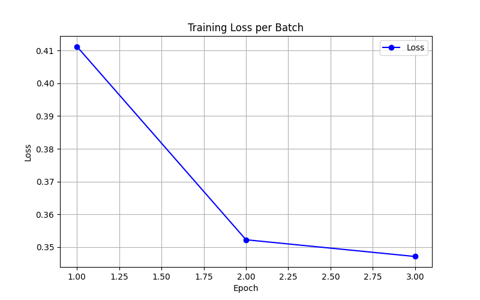

# Medical Image Segmentation
Integrating Active Contour Models with Attention Mechanisms in Deep Learning for Medical Image Segmentation

## Project Outline:
**Objective**: Develop a hybrid image segmentation model that integrates Active Contour Models (ACMs) and attention mechanisms in a baseline deep learning model (CNN), targeting medical images where precise boundary detection is crucial.

**Deliverables**:
1. A literature review on deep learning models for segmentation and ACMs.
2. A prototype of a hybrid ACM-attention deep learning model.
3. Performance evaluation on medical image datasets.
4. A final report detailing the approach, results, and challenges.

## Final Project Report
We will explain and demo some basic ideas in this README file. A more detailed and thorough explanation, experimentation, analysis, and challenges description is provided in the our final project report.
[View Project Report!](Graduate_Capstone_Report.pdf)

## Datasets 
* A collection of medical image datasets: https://drive.google.com/file/d/1iXFm9M1ocrWNkEIthWUWnZYY2-1l-qya/view 
* For our final model implementation and testing we used the lung COVID-19 CT-Scans Dataset: https://www.kaggle.com/datasets/maedemaftouni/covid19-ct-scan-lesion-segmentation-dataset. This dataset can also be downloaded by running `data/utils.py`.
* Other datasets we utilized for some initial experiments: ISIC, DRIVE, chase_db1. We found these datasets through Kaggle as well.
* ISIC: https://challenge.isic-archive.com/data/#2016
* Ensure all these datasets are downloaded under the `data/` folder of this repo.
* Note - some of the experiments/demos below will assume these datasets have been downloaded.

## Environment Setup
```bash
pip install -r requirements.txt 
```

## Active Contour Models
Active Contour Models (ACMs) are used to detect object boundaries in images by iteratively evolving curves to minimize an energy function. Although all ACMs follow the same energy minimization principle, their energy formulations and corresponding hyperparameters can differ, affecting performance across applications.

## Attention Mechanisms
**Base Attention Modules**: Scale module input using learned attention weights
**Edge Attention**: The Edge Attention Module enhances feature learning by combining image features with edge information. First, a convolution + ReLU extracts features from the module input. Edges are obtained from module input using robert's operator logic and passed through an attention layer to generate attention weights. These weights are applied to the features, allowing the network to focus more on edge-relevant regions.

## ACM Implementation References

**Deep Active Lesion Segmentation (DALS)**: DALS offers a fast level set active contour model (LSA), implemented entirely in Tensorflow, that can be paired with any CNN backbone for image segmentation.
https://github.com/ahatamiz/dals 

**Chan-Vese (CV) ACM Implementation in Kaggle**: Region-based ACM.
https://www.kaggle.com/code/naim99/active-contour-model-python


## Proof Of Concept
### ACM Usage
We extracted the ACM logic from both the DALS project and the CV Kaggle implementations and created a pipeline for easy experimentation with both of these ACM's. The pipeline involves image, ground truth, and initial segmentation (contour) pre-processing, constructing inputs to ACM, running ACM, logging, and saving results.

The code base for these experiments is in the [acm folder of model_plus_acm branch](https://github.com/shairaalam19/medicalimagesegmentation/tree/model_plus_acm/acm). The [Level_Set_ACM](https://github.com/shairaalam19/medicalimagesegmentation/tree/model_plus_acm/acm/Level_Set_ACM) subfolder has the code for the entire pipeline. The [scripts](https://github.com/shairaalam19/medicalimagesegmentation/tree/model_plus_acm/acm/scripts) folder is where we can easily adjust any inputs or parameters and trigger the pipeline to experiment with different configurations and ACMs. Tuning configuration here is basically updating the parameters to the run_lsa (for DALS LSA) or run_cv (for CV ACM) calls. The main parameters include original image, ground truth segmentation, initial contour, output_directory, wether or not to apply preprocessing techniques, how frequently to save intermediate ACM results, and hyperparameters. Our experiment output configurations were mainly directed to the [Results](https://github.com/shairaalam19/medicalimagesegmentation/tree/model_plus_acm/acm/Results) folder.

**Let's try a simple demo for Level Set ACM!**

1. Go to the correct [branch](https://github.com/shairaalam19/medicalimagesegmentation/tree/model_plus_acm/acm).
2. `cd acm/scripts`  
3. `python unet_lsa_dals_brain_demo.py`
4. This would run 2 versions of the DALS level set acm (LSA) on a brain scan
  Version 1: reproduces DALS demo results by using their provided input image, CNN generated initial contour, ground truth segmentation, and default hyper-parameters ($\nu$=5, $\mu$=0.2, iterations=600).
  Version 2: The same configuration as above but uses different hyper-parameters ($\nu$=0, $\mu$=0).
5. In each output directory, you should be able to see all the intermediate segmentation masks for every 50 iterations of ACM, plot of evolution of IOU and DICE scores throughout the ACM iterations, and an image of initial and final contour overlayed on the input.

Results for Version 1 ($\nu$=5, $\mu$=0.2, iterations=600):
<p float="left">
  
  
</p>


Results for Version 2 ($\nu$=0, $\mu$=0):
<p float="left">
  
  
</p>

This demo shows that the effectiveness of ACM on an image is highly dependent on image-specific hyper-parameter settings. 

**Let's try a simple demo for Chan-Vese ACM!**

1. Go to the correct [branch](https://github.com/shairaalam19/medicalimagesegmentation/tree/model_plus_acm/acm).
2. `cd acm/scripts`  
3. `python cv_skin_lesion.py`
4. This would run a Chan Vese ACM on an image from ISIC dataset (ensure this image has been downloaded at correct path). It starts with a simple square in the middle of the image as the initial contour and has the hyperparameter settings: $\nu$=100, $\mu$=1, iterations=150.

<p float="left">
  
  
</p>

Refer to the [report](Graduate_Capstone_Report.pdf) for detailed analysis of the two ACMs across different medical images, preprocessing techniques, and contour & hyperparameter initialization. It also outlines the motivation for moving forward with level-set ACM (with grayscale preprocessing) and integrating it into a neural network for adaptive contour and hyperparameter settings.


### Image Segmentation Usage
Call edge-based segmentation mechanisms (Roberts/Sobel) using the following command in the [POC branch](https://github.com/shairaalam19/medicalimagesegmentation/tree/POC): 
```bash
python image_segmentation/edge_based.py
```

## Hybrid Model Architecture
Here is a diagram of our final neural network architecture incorporating a baseline CNN, attention layers, and ACMS. Our main novelty is introducing an ”ACM Hyperparameter Generator” into the image segmentation CNN that can be trained to generate image-dependent optimal ACM hyperparameters for effective segmentation refinement. The model’s strong results on small datasets highlight its potential effectiveness, suggesting that it is well-suited for applications where high-quality segmentation is required on limited data samples. Future work can potentially focus on training efficiency with large datasets as backpropagating across ACM iterations is time-consuming.


## Model
### Running the final model
Fix the utils/config.json to your liking with various epochs, loss function criteria (IOU, DICE, BCE, etc), etc... 

Then run: 
```sh
python main.py
```

### Hybrid Model Demo
We trained the hybrid model (with acm) starting from pre-trained weights (gathered from training a baseline model with edge attention and without acm for ~11 epochs on entire Covid 19 CT Scan DataSet [pretrained baseline model](outputs/models/edge_attention_epoch_11.pth)) on a small dataset of 10 images with 80/20 train-test split ratio, 3 epochs and, BCE Loss. This small demo was done to closely follow the training process and ensure that ACM hyperparameters are being learned. Attached are the training losses over epochs and the results of testing the final model on the two test images.

<p float="left">
  
  
  
</p>

These are initial proof of concept demo results. The [report]((Graduate_Capstone_Report.pdf)) contains results and analysis after much more thorough training.